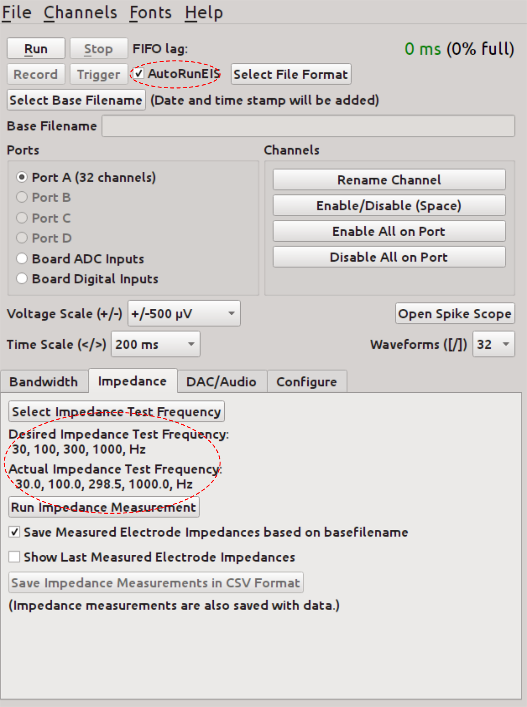
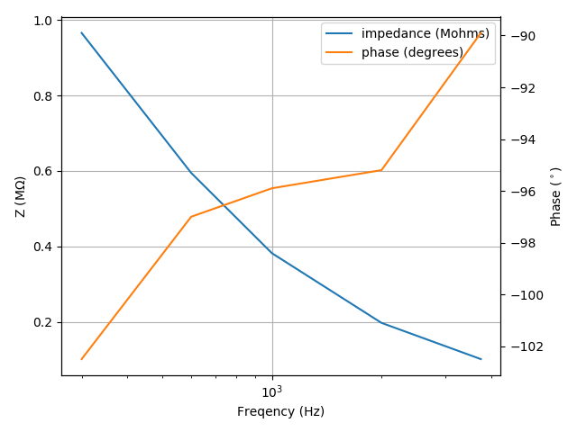
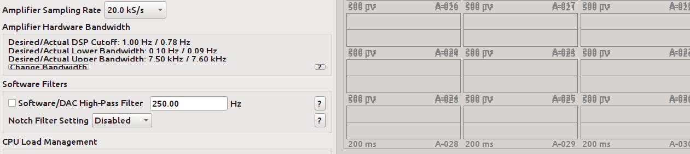
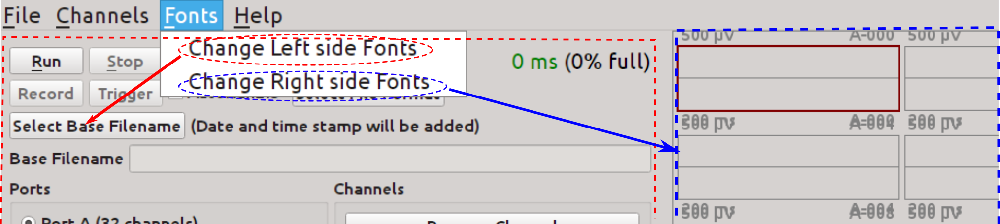
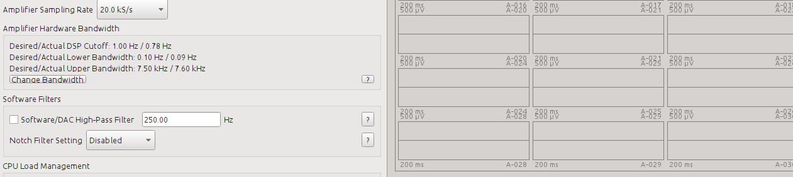
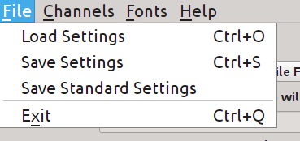

RHD2kGUI LW edition
========
the RHD20002kGUI is the Interface software for intantech RHD2000 evaluation system.

This edition enhanced the original RHD2kGUI program, by allowing Electrochemical Impedance Spectroscopy (EIS) on each individial electrode. It also automatically load settings from `~./rhd2kLWE/default.isf`, which can be very convienent when run several experiments with same configuration in parallel. 

>Citation for this project: [Chapman, C.A.R., *Wang, L.*, Chen, H., Garrison, J., Lein, P.J., Seker, E. Advanced Functional Materials 27:1604631 (2017)](dx.doi.org/10.1002/adfm.201604631)

## EIS scanning
### Interface
If the `AtuoRunEIS` is checked then it starts the EIS scanning on each enabled channel when recording started.

In the `Impedance` panel, now we can input a list of desired frequencies. The actual frequencies used in the program are calculated and displayed below. The filename can be automatically generated based on the basefilename.

One can still start the impedance scanning manually, with the `Run impedance measurement`.



### EIS data file
The data are saved as `.csv`
The EIS csv file is like this:
```
Channel Number,Channel Name,Port,Enabled,Impedance Magnitude at  300.000000, 600.000000, 1000.000000, 2000.000000, 3750.000000, Hz (ohms),Impedance Phase (degrees),Series RC equivalent R (Ohms),Series RC equivalent C (Farads)
A-000,A-000,Port A,1,3.000000e+02,4.657420e+06,-72.9,1.371045e+06,9.535137e-12
A-000,A-000,Port A,1,6.000000e+02,3.075658e+06,-83.5,3.461604e+05,1.388734e-11
```
The first line is some comments which can be ignored. Then it comes with data rows, which have following columns: 
```
    Channel Number,Channel Name,Port,Enabled,Hz,Impedance (ohms), Phase (degrees),Series RC equivalent R (Ohms),Series RC equivalent C (Farads)
```

If the scanning frequencies are: 300, 600, 1k, 2k, and 3.75k, then the loaded data is like this:

| Channel Number | Channel Name | Port   | Enabled | Hz           | Impedance (ohms) | Phase (degrees) | Series RC equivalent R (Ohms) | Series RC equivalent C (Farads) |
|----------------|--------------|--------|---------|--------------|------------------|-----------------|-------------------------------|---------------------------------|
| A-000          | A-000        | Port A | 1       | 3.000000e+02 | 4.657420e+06     | -72.9           | 1.371045e+06                  | 9.535137e-12                    |
| A-000          | A-000        | Port A | 1       | 6.000000e+02 | 3.075658e+06     | -83.5           | 3.461604e+05                  | 1.388734e-11                    |
| A-000          | A-000        | Port A | 1       | 1.000000e+03 | 1.837914e+06     | -87.4           | 8.377171e+04                  | 2.311613e-11                    |
| A-000          | A-000        | Port A | 1       | 2.000000e+03 | 8.718171e+05     | -97.8           | -1.186152e+05                 | 4.913837e-11                    |
| A-000          | A-000        | Port A | 1       | 3.750000e+03 | 4.466400e+05     | -109.0          | -1.454549e+05                 | 1.005024e-10                    |
| A-001          | A-001        | Port A | 1       | 3.000000e+02 | 1.435662e+06     | -95.0           | -1.254829e+05                 | 2.967577e-11                    |
| A-001          | A-001        | Port A | 1       | 6.000000e+02 | 7.301232e+05     | -93.3           | -4.203666e+04                 | 5.822557e-11                    |
| A-001          | A-001        | Port A | 1       | 1.000000e+03 | 4.378847e+05     | -94.4           | -3.384901e+04                 | 9.721438e-11                    |
| A-001          | A-001        | Port A | 1       | 2.000000e+03 | 2.117935e+05     | -96.8           | -2.496076e+04                 | 2.017964e-10                    |
| A-001          | A-001        | Port A | 1       | 3.750000e+03 | 1.053514e+05     | -96.2           | -1.130027e+04                 | 4.051925e-10                    |
| A-002          | A-002        | Port A | 1       | 3.000000e+02 | 8.124212e+06     | -91.6           | -2.254001e+05                 | 5.226065e-12                    |

### load the csv data
We can use the popular python package [pandas](http://pandas.pydata.org/) to load the data:

```
import pandas as pd
columns = ['Channel Number','Channel Name','Port','Enabled','Hz','Impedance (ohms)', 'Phase (degrees)','Series RC equivalent R (Ohms)','Series RC equivalent C (Farads)']
a = pd.read_csv('Serum_Media_on_EIS_160511_012211.csv', sep = ',', skiprows=[0,], names =columns, index_col=[0, 4]) # this will use the channel number and the frequency as 2-level index.
```
Access the loaded data is quite easy now:
```
>>> a.loc['A-000']
       Channel Name    Port  Enabled  Impedance (ohms)  Phase (degrees)  \
Hz                                                                        
300.0         A-000  Port A        1         4657420.0            -72.9   
600.0         A-000  Port A        1         3075658.0            -83.5   
1000.0        A-000  Port A        1         1837914.0            -87.4   
2000.0        A-000  Port A        1          871817.1            -97.8   
3750.0        A-000  Port A        1          446640.0           -109.0   

        Series RC equivalent R (Ohms)  Series RC equivalent C (Farads)  
Hz                                                                      
300.0                      1371045.00                     9.535137e-12  
600.0                       346160.40                     1.388734e-11  
1000.0                       83771.71                     2.311613e-11  
2000.0                     -118615.20                     4.913837e-11  
3750.0                     -145454.90                     1.005024e-10  
```
Now it can be plotted by [matplotlib](https://matplotlib.org/):

```
import matplotlib.pyplot as plt
 def plot_eis(a, channel):
	impedance = a.loc[channel]['Impedance (ohms)']
	phase = a.loc[channel]['Phase (degrees)']
	fig,ax=plt.subplots()
	ax2 = ax.twinx()
	_ips = ax.plot(impedance/1E6, label='impedance (Mohms)', color='C0')
	_phs = ax2.plot(phase, label='phase (degrees)', color='C1')
	lns = _ips + _phs
	labs = [l.get_label() for l in lns]
	ax.set_xscale('log', nonposx='clip')
	ax.legend(lns, labs)
	ax.grid()
	ax.set_xlabel("Freqency (Hz)")
	ax.set_ylabel(r"Z (M$\Omega$)")
	ax2.set_ylabel(r"Phase ($^\circ$)")
	plt.show()

plot_eis(a, 'A-005')
```
The result looks like this: 




## Change the fonts
It is very common, that one find the default font does not work under their OS/Display settings. For example:  We can see the font is too big making the text unreadable in both left and right panels. 
In standard edition, we have to change the system fonts to sovle this issue which is very annoying.

Now in this edition, we can simple use the font menu to change them: 

After I change left side font to 10 and right side font to 9, the text looks good: 

## Automatic load your experiment settings
It is common that one will run lots of experiments with the same settings. In standard edition, one have to keep loading the settings after reopenning the GUI. In this edition, the settings are automatically loaded from `~./rhd2kLWE/default.isf`. One can save a `default.isf` once he/she is happy about the current settings. After that, repeating experiments with same config does not require manually loading setting file any more.


